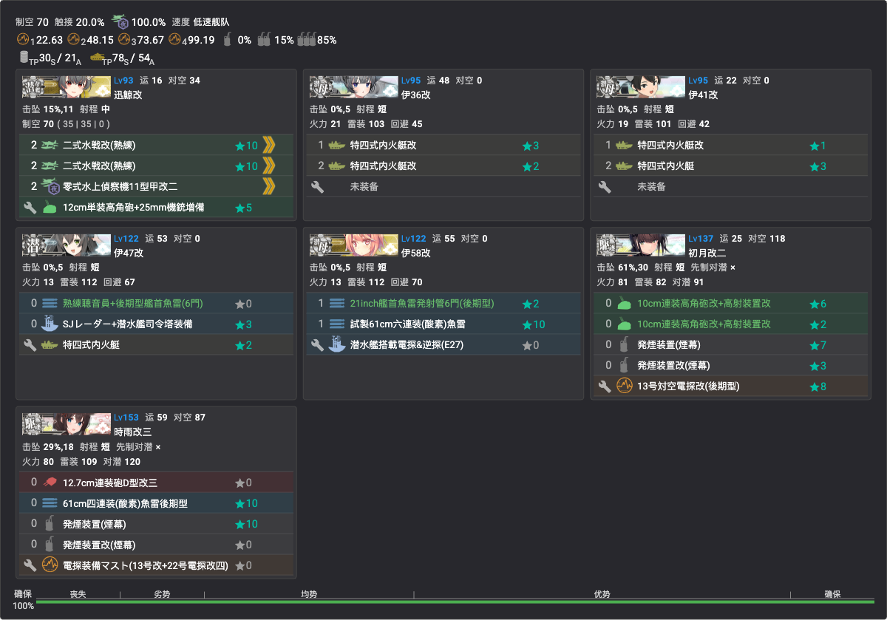
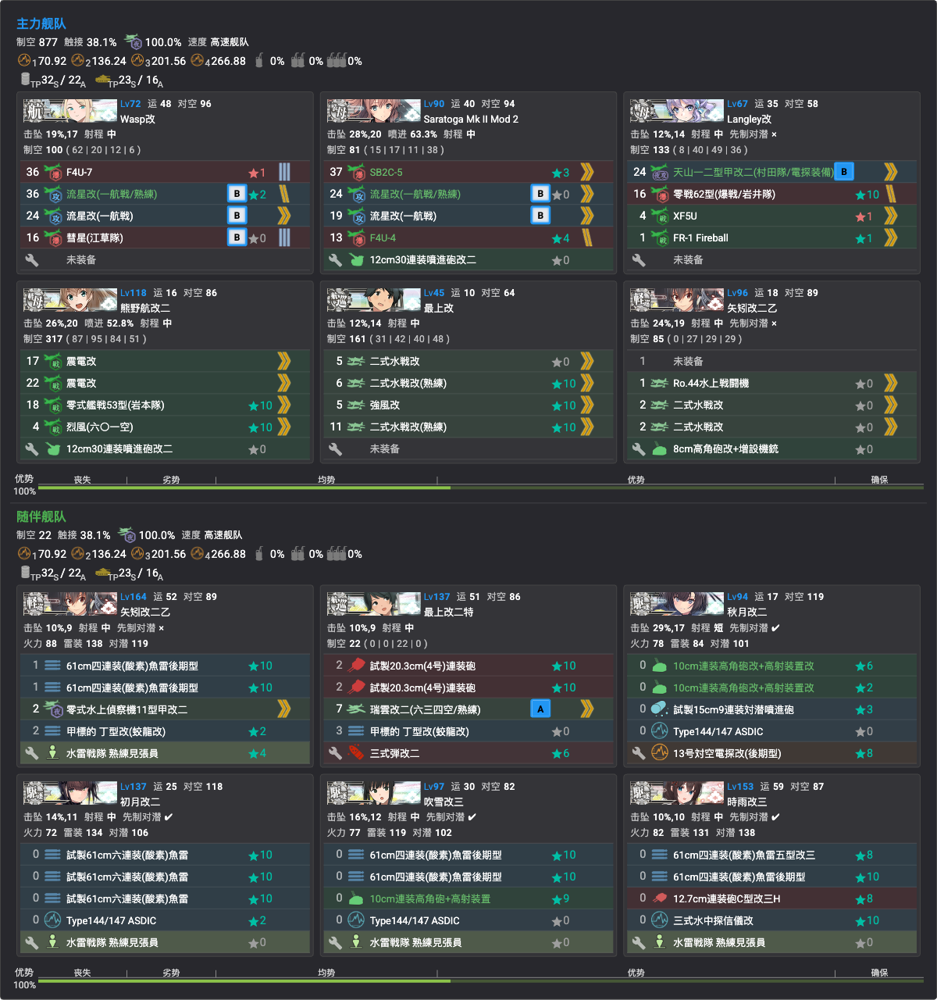
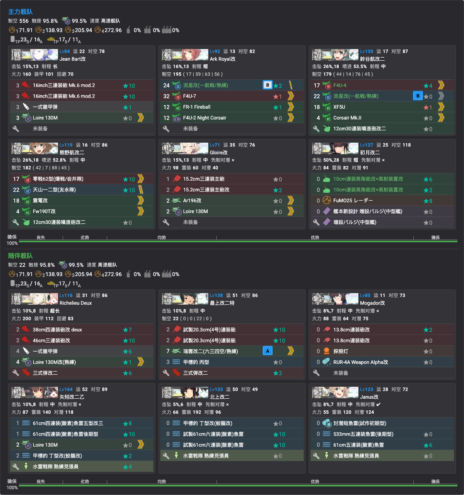
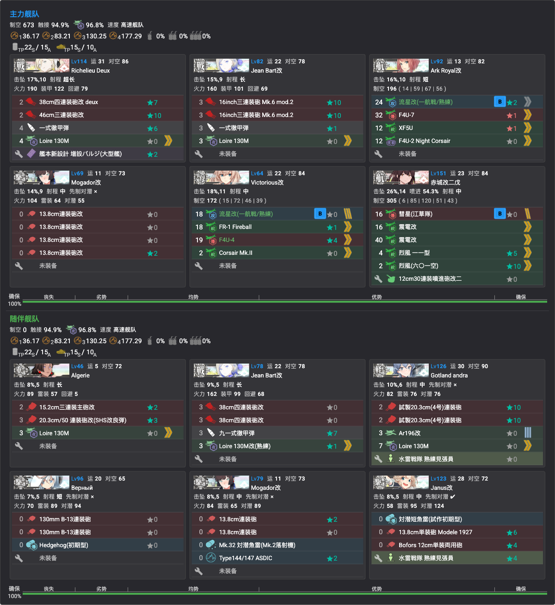

# 捞船点位与配置

> 全甲通关后的捞船期方案（2026-07-23 起）。掉率数据见[掉落一览](掉落一览.md)；**单舰队可出击的点位优先**（省资源、免连合编成）。
> **战果（截至 2026-07-26）**：✅花月／✅桐／✅凉月（E1 X）、✅Indiana（E3）、✅Visby／✅日枝丸（E5 ZZ）——**剩余目标：Vautour、Conte di Cavour（E4 Z 一点双收）**

## 当前缺口与对应方案

### ✅E1 X 点：花月＋桐＋凉月（已收，2026-07-26）
- **掉率（甲，kcwiki n=24013）**：花月 2.73%／桐 2.35%／凉月 1.03%——三舰合计约 6.1%/次；A 胜可掉但 **S 胜掉率更高，尽量 S**
- **编成**（✅已录入，见下图）：沿用 [E1 P3 攻坚编成](../02-海域攻略/E1/概览.md#p3攻坚-斩杀ラスダン)（7DD 游击，増強札，✅单舰队）——旗舰带游击司令部，防空 CI＋发烟担当＋水雷夜战组
- **路线** 2-M-P-Q-Q2-V2-V-X；⚠️ V→X 索敌门（系数4 ≥80）电探别拆
- **X 点（boss）拉烟**；**陆航可派 V 点（boss 前一点）**——通关后无空袭，可全力出击
- 顺带：第二十二号/第三〇号海防舰、冬月、杉、榧同点

### ✅E3 X 点：Indiana（潜艇队，最省｜已收，2026-07-26）
- **掉率**：0.52%（kcwiki）~0.86%（TsunDB）**S 限**
- **编成**（✅已录入，见下图）：**AS+2DD+4潜** 最短路队（✅单舰队）——AS 旗舰全水战凑制空（X 点确保），4 潜内火艇/鱼雷（内火艇 1.95 倍卡），防空 CI＋双发烟 DD×2
- **路线**：**最短路 3-R-T-V-X**（AS≥1 且 DD≥2 是 R→T 钥匙，低速可，T/V 两个分歧同样放行，AS 在 X 点另吃 1.38 倍卡）；**V 点（重巡水雷）拉烟**；7 潜艇队（无 AS）低速则走 3-R-**S**-T-V-X 多打一个 DD 水雷点；**忌带 CA**——AS+CA+DD 能过 T 但 V 点被弹去 W 吃ネ改
- 嫌 S 胜难 → 下方 **E3 Z 点连合队**（3.25% S/A）或 E2 Y 点 2.53%

### ✅E3 Z 点：Indiana＋美舰池（连合，S/A 可掉｜Indiana 已收）
- **掉率**：Indiana **3.25%**（S/A）；顺带 Lexington 1.6%、伊13 1.5%、Wasp 1.1%、Iowa 0.6%、Saratoga 0.5%（S/A），Intrepid 0.7%（**S限**）
- **编成**（✅已录入，见下图）：**高速统一连合**——主力 CV×2＋CVL×2＋CAV＋CL 堆制空（CV系恰好 4），随伴 CL＋CAV＋4DD（水雷夜战＋防空 CI＋先制反潜）
- **路线**：2-F-A2-G-H（能动选 M）-M-Y1-U-**Y**-Z——**高速统一在 U 点直达 Y**，比通关路线省掉 Y2 空袭点；Y 点塔姐门神
- **带路要点**：连合→G→H；M 点 **CV系（含CVL）≤4**（≥5 弹 N）；U 点**全队高速**（含低速弹 Y2）；Y→Z 甲实测零被弹（电探正常带）

### E4 Z 点：Vautour＋Conte di Cavour（一队双收，TsunDB 2026-07-26）
- **掉率（甲，n=1739）**：Vautour **3.91%**／Conte di Cavour **1.15%**（均 S/A 可掉，S 更高）；同点顺带 Littorio 0.5%、G.Garibaldi 0.9%、Richelieu 0.3%、Mogador 0.2%（S/A），Aquila 0.6%、Zara 0.5%（S限）
- ⚠️ **两舰实质仅此一点**：全图聚合 Vautour 70 例中 68 例在 Z、2 例在 X（0.18% **S限**，无实用价值）；Cavour 20 例**全部**在 Z——绕不开 P5 boss（本活动最难点），好在 **A 胜也可掉**
- **编成**（✅已录入，见下图）：高速连合（仏地中海艦隊札）——主力法戦＋三航堆制空＋防空 CI，随伴 Richelieu Deux＋雷巡/水雷雷击组；多机 Loire 130M 吃倍卡；**无特殊攻击、无发烟**，纯堆卡平推
- **路线** 3-O-P-P1-T-T1-U-Y-Z（一阵-一阵-三阵-四阵-boss二阵）
- **陆航**：一队**东海炸 T1 炸鱼点**（防潜艇点大破），也可以一队**陆攻炸 Z 点 boss**
- 通关后 boss 为满血 1200 非斩杀形态

### ✅E5 ZZ 点：日枝丸（＋速吸／まるゆ｜Visby・日枝丸均已在此收获，2026-07-26）
- **掉率（甲，n=1895）**：日枝丸 **2.48%**（S/A 可掉）；顺带速吸 3.4%、Nelson/Rodney 0.3~0.4%（S/A），Glorious 1.5%、まるゆ 1.1%（S限）
- **编成**（✅已录入，见下图）：高速连合法舰堆卡版（欧州連合艦隊札，④出发走法舰≥3/Algérie 条件）——主力法戦×2＋空母×3 堆制空＋Mogador，随伴 Algérie＋法戦②＋防空/对潜 DD；全队多机 Loire 130M 吃 SP 1.12 倍卡
- **路线** 4-U-V-X-Y-Y1-Z-ZZ（一阵-四阵-四阵-四阵-boss二阵摸）；Z 点（ne改II 门神）陆航照旧
- **低成本替代（只求日枝丸）**：[E5 P2 输送编成](../02-海域攻略/E5/概览.md#p2输送boss-j2-点)打 J2 点 1.63%（**S限**，泊地水鬼 490 血，输送连合较省）；S 点 1.15% 亦可但同样 S 限；**最省是 G 点单舰队 0.63%（S限）**——见下方单舰队 boss 一览

### 天城／葛城
- **本活动全图零掉落，定案**：前段 kcwiki 全量＋后段 TsunDB 全边聚合（E4 n≈24,426／E5 n≈27,614）均无记录，不必再找

## 单舰队可出击的 boss 点一览（甲，TsunDB 通过编成验证 2026-07-26）

| boss 点 | 单舰队通过 | 主流编成 | 捞船价值 |
|---------|-----------|----------|----------|
| E1 I（P1） | ✅100% | CL＋5DD 游击 | 竹/桃/海防舰（S限低率） |
| E1 T（P2 输送） | ✅100% | CL＋CVL＋5DD | 竹 1.4%／梅 1.2%／桃 1.0%／桐 0.9%（均 S限） |
| E1 X（P3） | ✅100% | 7DD | ✅花月/桐/凉月已收；冬月/榧/海防舰仍可捞 |
| E2 P（P1 输送） | ✅100% | 7DD | 伊36/41 0.2~0.3%（S限）——E2 唯一单队 boss |
| E3 Q（P2 输送） | ✅100% | 轻快 7 舰 | 伊26/第百一号低率 |
| E3 X（P3） | ✅100% | 潜艇队 | ✅Indiana 已收；伊401 1.1%／平安丸 0.9%／大鳳 0.2~0.4%（S限） |
| E4 D（P1） | ✅100% | CA/CAV/CL＋4DD 游击 | Pola 0.4%／Teste 0.1%（S限）——**后段唯一实用单队 boss** |
| E4 N（P2 输送） | ⚠️少量（CA＋CAV＋2DD 四舰记录） | 以连合为主 | Pola 0.5%／Teste 0.1%（S限） |
| E5 G（P1） | ✅100% | CL＋CVL＋5DD（对潜向） | **日枝丸 0.63%（S限）——免连合最低成本选项** |

> **必须连合的 boss**：E2 V/Y、E3 O/Z、E4 S/X/Z、E5 J2/S/ZZ（以上各点单舰队通过权重为 0）。
> 结论：剩余目标里 **Vautour/Cavour（E4 Z）无单舰队方案**；日枝丸可用 E5 G 单队保底、ZZ 连合博高率。

## 通用提示
- 捞船期锁船无新风险（全札已开），但仍**核对出发点/带路条件**避免误走
- **S 胜掉率高于 A 胜**——即使 A 胜可掉，打得过就争取 S；A 胜只作打不过时的保底
- 捞船编成的旗舰放 MVP 调整位练级两不误
